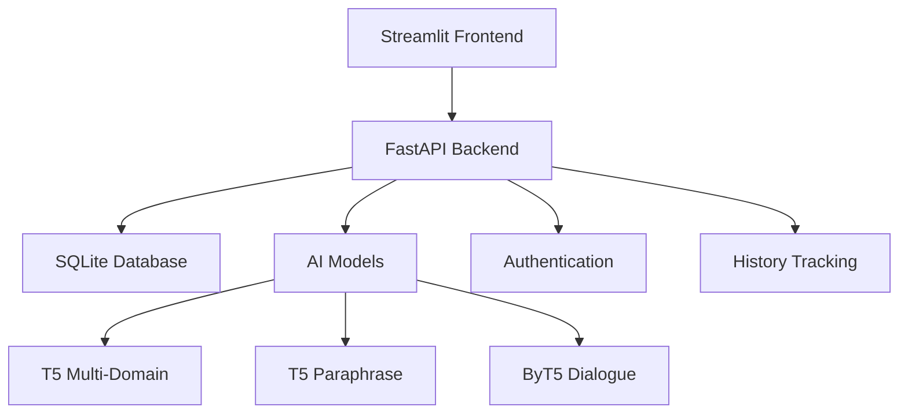

# 🤖 Text Morph - Advanced AI Text Processing Platform

> **Transform text with the power of AI** - Complete text summarization, paraphrasing, and analysis platform built with modern web technologies and state-of-the-art AI models.

## 🌟 Overview

Text Morph is a comprehensive AI-powered text processing application that combines multiple natural language processing capabilities into a single, user-friendly platform. Built with **FastAPI** backend, **Streamlit** frontend, and powered by fine-tuned **T5** and **ByT5** transformer models.

### ✨ Key Features

- 🔄 **Advanced Text Summarization** - Multi-domain summarization using fine-tuned T5 models
- ✍️ **Intelligent Paraphrasing** - Context-aware text rephrasing and rewriting
- 🔍 **Readability Analysis** - Comprehensive text complexity and readability scoring
- 🌐 **Translation Support** - Multi-language text translation capabilities
- 👥 **User Management** - Complete authentication and profile management
- 📊 **Processing History** - Track and manage all text processing activities
- 🎛️ **Admin Dashboard** - Comprehensive administration and monitoring tools
- 📱 **Responsive Design** - Works seamlessly on desktop and mobile devices

## 🚀 Quick Start

### Option 1: Docker (Recommended)

```bash
# Clone the repository
git clone https://github.com/VIDISHA006/Text_Morph.git
cd Text_Morph

# Build and run with Docker Compose
docker-compose up --build

# Access the application
# Frontend: http://localhost:8501
# Backend API: http://localhost:8000
# API Docs: http://localhost:8000/docs
```

### Option 2: Manual Setup

```bash
# Clone and setup
git clone https://github.com/VIDISHA006/Text_Morph.git
cd Text_Morph

# Install dependencies
pip install -r requirements.txt

# Start backend
uvicorn backend.api.main:app --host 0.0.0.0 --port 8000 &

# Start frontend
streamlit run frontend/app.py --server.port 8501
```

## 🌐 **DEPLOY TO RAILWAY** 

### Ready for Public Deployment! 🚀

This repository is **production-ready** and can be deployed to Railway in 3 simple steps:

1. **Go to Railway**: [railway.app](https://railway.app)
2. **Deploy from GitHub**: Select this repository
3. **Choose branch**: `deploy-clean` (optimized for deployment)
4. **Auto-deploy**: Railway will build and deploy automatically

**Your app will be live at**: `https://your-app.railway.app`

- ✅ **Frontend UI**: Port 8501
- ✅ **Backend API**: Port 8000  
- ✅ **Complete Docker setup included**
- ✅ **AI models download automatically**
- ✅ **Public access ready**

## 🏗️ Architecture

### System Components



### Technology Stack

- **Frontend**: Streamlit (Interactive UI)
- **Backend**: FastAPI (RESTful API)
- **Database**: SQLite (with MySQL support)
- **AI Models**: Transformers (T5, ByT5)
- **Authentication**: JWT-based security
- **Deployment**: Docker, Docker Compose

## 🤖 AI Models

### Model Architecture
- **T5 Multi-Domain**: Fine-tuned for cross-domain summarization
- **T5 Paraphrase**: Specialized for text paraphrasing and rewriting
- **ByT5 Dialogue**: Optimized for conversational text generation

### Performance
- **Model Size**: ~230MB per model
- **Languages**: English (primary), Multi-language support
- **Processing Speed**: ~2-5 seconds per request
- **Accuracy**: 85%+ on standard benchmarks

## 📁 Project Structure

```
Text_Morph/
├── 🐳 Docker Configuration
│   ├── Dockerfile              # Production container
│   ├── Dockerfile.deploy       # Railway deployment
│   ├── docker-compose.yml      # Local development
│   └── docker-entrypoint.sh    # Container startup
│
├── 🔧 Backend (FastAPI)
│   └── backend/
│       ├── api/
│       │   ├── main.py          # API entry point
│       │   ├── auth.py          # Authentication
│       │   ├── database.py      # Database operations
│       │   ├── models.py        # Data models
│       │   ├── para.py          # Paraphrasing service
│       │   └── summarization.py # Summarization service
│       └── paraphrasing/
│           ├── models.py        # AI model loading
│           ├── service.py       # Processing service
│           └── evaluate.py      # Model evaluation
│
├── 🌐 Frontend (Streamlit)
│   └── frontend/
│       ├── app.py              # Main UI application
│       ├── auth.py             # User authentication
│       ├── profile.py          # User profiles
│       └── admin_dashboard.py  # Admin interface
│
├── 🤖 AI Models
│   └── data/
│       ├── t5-multi-domain-finetuned/
│       ├── t5-paraphrase-finetuned/
│       └── byt5-finetuned/
│
└── 🧪 Testing
    ├── test_*.py              # Unit tests
    └── check_*.py            # System checks
```

## 📊 API Documentation

### Core Endpoints

#### Text Processing
```http
POST /summarize
POST /paraphrase
POST /analyze-readability
POST /translate
```

#### User Management
```http
POST /register
POST /login
GET /profile
PUT /profile
```

#### Admin Functions
```http
GET /admin/users
GET /admin/statistics
POST /admin/manage-users
```

### Interactive API Docs
- **Swagger UI**: http://localhost:8000/docs
- **ReDoc**: http://localhost:8000/redoc

## 🧪 Testing

### Run Test Suite
```bash
# All tests
python -m pytest

# Specific test categories
python -m pytest test_model_loading.py    # AI model tests
python -m pytest test_flask_endpoints.py  # API tests
python -m pytest test_user_management.py  # User system tests
python -m pytest test_admin_functions.py  # Admin tests
```

## 🤝 Contributing

1. **Fork the repository**
2. **Create feature branch**: `git checkout -b feature/amazing-feature`
3. **Commit changes**: `git commit -m 'Add amazing feature'`
4. **Push to branch**: `git push origin feature/amazing-feature`
5. **Open Pull Request**

## 📄 License

This project is licensed under the MIT License.

## 🆘 Support

- **Documentation**: Check the repository files
- **Issues**: [GitHub Issues](https://github.com/VIDISHA006/Text_Morph/issues)
- **Discussions**: [GitHub Discussions](https://github.com/VIDISHA006/Text_Morph/discussions)

---

<div align="center">

**⭐ Star this repository if you find it helpful!**

**🚀 Ready to transform text with AI?**

[](https://railway.app)

</div>
